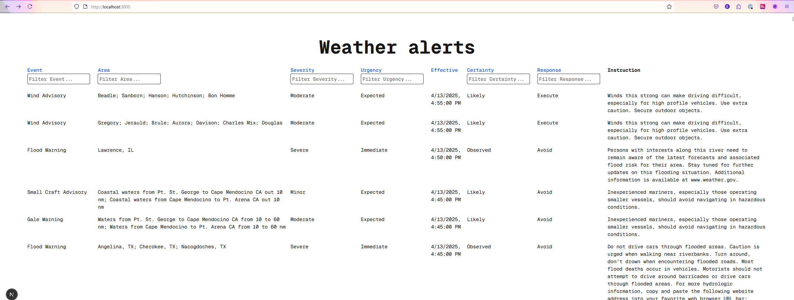

This is a [Next.js](https://nextjs.org) project bootstrapped with [`create-next-app`](https://nextjs.org/docs/pages/api-reference/create-next-app).

## Getting Started

First, run the development server:

```bash
npm run dev
```

Open [http://localhost:3000](http://localhost:3000) with your browser to see the result.

## What it looks like




## Limitations

- The NWS api paging params didn't seem to work. When I used `limit`, the response was no smaller
  - https://api.weather.gov/alerts/active?limit=5
  - https://www.weather.gov/documentation/services-web-api#/default/alerts_active

## Decisions

- Using **nextjs** because it's really quick and easy to spin up a site with routing
- Using ServerSide Rendering so the api call and mapping happens in the server layer
- Using React Table to quickly build the sorting and filtering functionality. There's a lot of state to keep track of, and so this library saved a lot of time and potential bugs
- I didn't think all fields should be filterable or sortable eg the instruction field is very wordy, so can't see the value in being able to sort by it
- I used a lighter model on the listing page because less data is needed for rendering, and there's lots of results.
- I used a bigger model for the details page since this is where you want to see more details about an alert.
- I filtered the NWS alerts API to only include actual alerts. My assumption is that the users of this site only want to see real alerts and not tests

## If I had more time...

- I would spend more time styling the components to make them look more visually appealing
- I would split the pages into their own components
- Added unit testing. For time's sake I decided to prioritise the table functionality. In my day-to-day work I almost always add or extend unit tests
- Added a CI pipeline to verify the quality of the code and whether it builds
- I would remove some more fields from the `BasicWeatherAlert` that aren't being used
